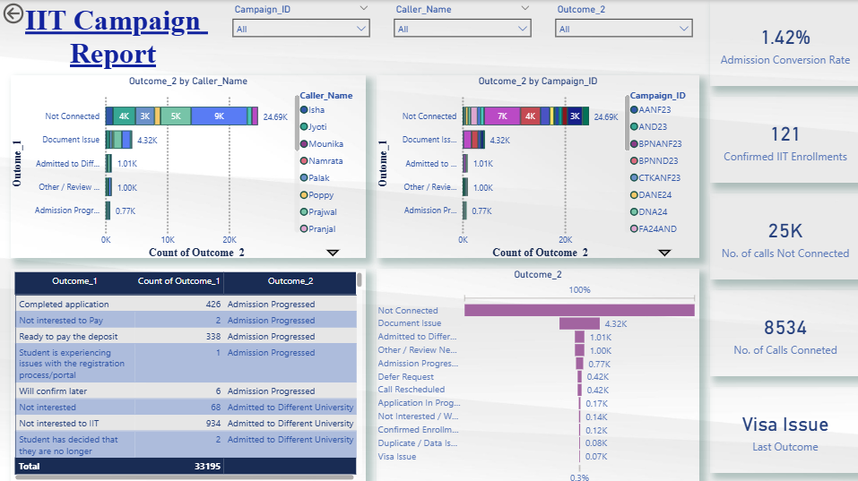

# IIT Outreach Campaign Analysis

## Overview

This project analyzes outreach campaign data from the Illinois Institute of Technology (IIT) to evaluate campaign performance, identify bottlenecks in the admission funnel, and improve student conversion rates.

Using a dataset of over **33,000 outreach records**, the analysis focuses on **call outcomes, caller performance, and operational challenges** such as non-connected calls, document delays, and visa issues.

The project integrates **data cleaning, exploratory analysis, and interactive dashboarding using Power BI** to provide actionable insights for stakeholders.

---

## Objectives

The project answers key business questions:

1. What are the major bottlenecks in the admission funnel?
2. What is the admission conversion rate?
3. How effective are outreach campaigns and callers?
4. What actions can improve conversion rates to the target of **15%**?

---

## Data Sources

### Outreach Dataset
Contains call-level outreach data including:

* Reference ID
* Timestamp (Received_At)
* Caller Name
* Campaign ID
* Outcome (Outcome_1)
* Remarks

### Applicant Dataset
Contains applicant-level information related to admissions.

### Campaign Dataset
Reference dataset used for campaign classification and grouping.

---

## Methodology

### 1. Data Preparation

* Cleaned missing and inconsistent values
* Standardized text fields (Outcome, Remark)
* Removed duplicate records
* Normalized phone and categorical fields
* Structured timestamp into date and time

---

### 2. Outcome Categorization

Raw outcomes were grouped into structured categories:
```
Not Connected
Invalid Contact
Follow-up Required
Application in Progress
Document Pending
Deposit Pending
Confirmed Enrollment
Deferred / Future Term
Not Interested
```
This enabled consistent analysis across datasets.

---

### 3. Exploratory Data Analysis

Performed analysis on:

* Outcome distribution
* Call connectivity (Connected vs Not Connected)
* Caller performance comparison
* Campaign-wise performance
* Remark-level issue tracking

---

### 4. Funnel Analysis

A structured admission funnel was created:
```
Leads → Connected → Application → Deposit → Enrolled
```
This helped identify drop-offs and inefficiencies in the process.

---

## Dashboard

The final analysis was visualized in Power BI, including:

* KPI metrics:
  - Admission Conversion Rate
  - Connected Calls
  - Non-Connected Calls

* Interactive filters:
  - Campaign ID
  - Caller Name
  - Outcome Category

* Visualizations:
  - Outcome distribution
  - Campaign performance funnel
  - Caller performance comparison
  - Admission funnel analysis

Example dashboard:



---

## Technologies Used

* Python
* Pandas
* NumPy
* Matplotlib
* Seaborn
* Power BI

---

## Repository Structure
data/ -> raw and cleaned datasets
notebook/ -> data cleaning and EDA notebooks
powerbi/ -> Power BI dashboard (.pbix) and screenshots
reports/ -> data quality report and documentation

---

## Key Insights

* **Non-connected calls (~24.6K)** were the largest operational gap
* Major bottlenecks included:
  - Document submission delays
  - Application follow-ups
  - Visa-related issues
* Significant variation observed in caller performance
* Admission conversion rate was approximately **1.42%**

---

## Recommendations

To improve conversion rate toward **15%**:

* Prioritize follow-ups for connected leads
* Improve contact data quality to reduce non-connected calls
* Implement structured workflows for document submission
* Provide targeted support for visa and deferment cases
* Monitor and optimize caller performance

---

## Project Outcome

This project transformed raw outreach data into a structured analytical framework that enables stakeholders to:

* Monitor campaign performance
* Identify bottlenecks in the admission funnel
* Compare caller effectiveness
* Make data-driven decisions to improve conversion rates

---

## Future Improvements

* Predictive modeling for lead conversion
* Caller performance scoring model
* Real-time dashboard integration
* Automated follow-up prioritization system

---
